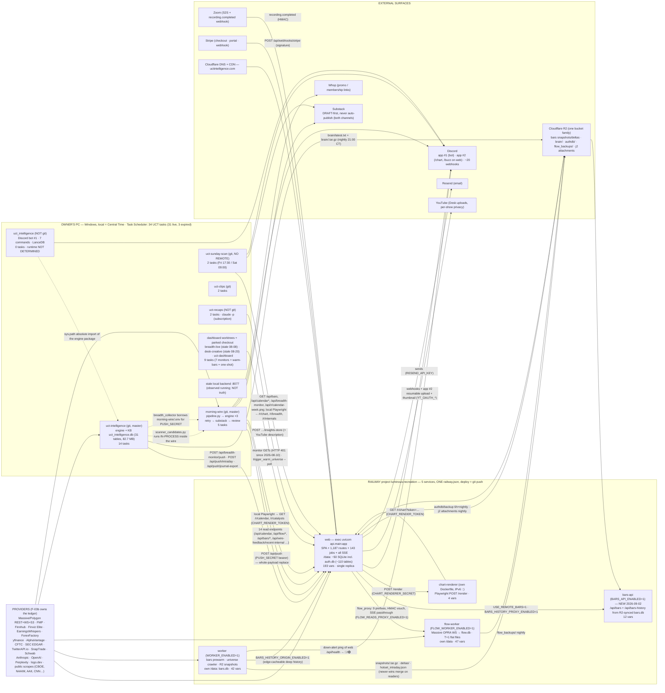

# System map — the UCT ecosystem as it actually runs (gate item 2)

**Vocabulary.** TERMINAL-CURRENT = the surface at route `/calendar`, display-named "UCT Terminal" since 2026-09-01 (commits `b958aefb4` + `7c8d89581`; `88b87a32b` is the merge that carried them). TERMINAL-NEXT = the product this program designs. Brand: UT is the parent, UCT Intelligence is the product.

**How to read this file.** Every statement carries a leaf-report citation (`D-nn §x`) and, where the leaf did, a `path:line`. Production-behaviour statements are labelled **CONFIRMED** (a log line, a health payload, a scheduler entry, a variable read, a production render) or **CLAIM** (code, comment, config, doc). Provider status uses the ascending vocabulary KEY-PRESENT → CODE-REFERENCED → OBSERVED-CALLED → CONTRACT-ACTIVE. Where two leaves disagreed, §12 records Position A / Position B / Evidence / Resolution, and the body uses the resolved value. Companion artifacts by the same writer: `capability-ledger.md` (gate item 3) and `tech-debt-register.md` (Part CXVIII). Out of scope here, cited by path: the provider ledger (`02-data-providers/provider-ledger.md`, F-03b) and the licensing register (`09-security-licensing-cost/licensing-register.md`, F-04).

**Leaf key.** D-01 frontend-archaeology · D-02 backend-archaeology · D-03 provider-inventory-dashboard · D-04 database-and-infrastructure · D-05 current-performance-and-realtime · D-06 current-ui-architecture · D-07 testing-reliability-observability · D-08 coexistence-current-mechanisms · D-09 terminal-current-map · D-10 flags-and-entitlements · D-11 state-persistence-and-workspaces · D-12 existing-ai-systems · D-13 proprietary-asset-inventory-raw · D-14 ecosystem-cartography · ORCH railway-flag-state (ORCH-RAILWAY-01, DL-012).

---

## 0. The map in six sentences

1. **Two machines run the product.** The owner's Windows PC (Central Time) hosts 34 `UCT*` Task Scheduler jobs across six code locations plus three dashboard worktrees; Railway project `luminous-recreation` hosts **five** services built from one repository and one shared `railway.json` (D-14 §2–3, ORCH — CONFIRMED). There is no third host in evidence; where the Discord bot runs is NOT DETERMINED (RG-19).
2. **The dashboard `web` pod is a monolith** — one uvicorn process, one event loop, one 64-slot threadpool, 1,187 declared routes, 143 scheduler job ids, ~34 boot daemon threads, ~50 SQLite files on its volume, and 67 live threads observed (D-02 §0, §1.3 — CONFIRMED by `/api/health`; D-04 §8).
3. **Three tiers have already been split off it**: `worker` (bars pre-warm + R2 snapshots), `flow-worker` (Massive OPRA WebSocket + `flow.db`, proxied from web), and — dated 2026-09-02 and CONFIRMED deployed — `bars-api` (serves `/api/bars*` from an R2-synced `bars.db`); `chart-renderer` is a fifth, Dockerfile-built Playwright service (D-02 §2, D-04 §5.2, D-14 §3, ORCH).
4. **Data enters from the PC, not from Railway**: the morning wire pushes the whole `wire_data` payload (`POST /api/push`), the breadth collector pushes daily snapshots, the brain modes push intraday, the brain pack rides R2 — all CONFIRMED by 2026-09-01 logs and scheduler results (D-14 §1.2, §1.4, §2.4).
5. **The external surface is Discord (two applications, ~20 webhooks), Substack (draft-first in both channels), YouTube + Zoom (the Desk), Cloudflare R2, Stripe, Resend, Whop, and Cloudflare DNS/CDN** — plus a headless screenshot contract (`/r/*` + `CHART_RENDER_TOKEN`) with three independent consumers (D-14 §4–5, D-03 §1.3–1.5).
6. **Four PC jobs are failing silently and nothing watches the scheduler** (D-14 §2.5, CONFIRMED by artifacts); the pod's own alert channel is Discord, which is also the first thing to go quiet (D-14 §6.3).

---

## 1. One-page overview

**Data-flow legend.** Solid = HTTP push/read (CONFIRMED where a log or render says so — §5.1 names them); dashed = filesystem / import coupling (CLAIM from code); R2 edges = object-store bus (mechanism CONFIRMED in code, upload success NOT DETERMINED — D-04 §4). Cloudflare 1010-blocks non-browser user agents (D-05 §8, project memory). Every scheduled time on the PC is **local Central**; the Railway scheduler runs in `America/New_York` (D-14 §2.1, D-02 §1.2).

---

## 2. Repositories and code locations

### 2.1 The inventory (D-14 §1, D-02 §0, D-01 §1)

| # | Location | Purpose | Entry points | Deploy path | Git state (CONFIRMED by D-14 read-only `log`/`remote`) | Tests | Reaches the dashboard by |
|---|---|---|---|---|---|---|---|
| 1 | `C:\Users\Patrick\uct-worktrees\terminal-research` — **the dashboard repo** (`uct-dashboard`), React 19 + Vite 7 SPA in `app/`, FastAPI in `api/`, `services/chart_renderer/` | the product: SPA + all `/api/*` + jobs + the four Python service personalities | `api/main.py` (web), `api/worker_main.py`, `api/flow_worker_main.py`, `api/bars_api_main.py`, `services/chart_renderer/app.py` | **`git push` to `master` = production deploy** on Railway; no CI gate; watch paths per service in the Railway dashboard only (D-04 §5.3, D-07 §3) | branch `terminal-research` @ `a4ef6f240` = `origin/master` `9c3df14b9` + charter; master drifted to `c9ae85fb6` during Wave 1 (DL-011); 1,046 `.py` under `api/`, 2,068 JS/JSX under `app/src` | 1,188 backend test files (1,065 `tests/` + 123 under `api/`), 959 frontend (D-07 §2.1) | it *is* the dashboard |
| 2 | `C:\Users\Patrick\uct-intelligence` | trading **engine / knowledge base**: scanner, breadth collector, five brain modes, UCT20 Book, KB SQLite | ~60 CLIs in `scripts/` (`autonomous_brain.py --mode …`, `breadth_collector.py`, `market_ingest.py`, `eod_updater.py`, `brain_pack_export.py`, `sync_book_bars.py` …); `uct_intelligence/` package (`api.py`, `book/`, `harness/`) | never deployed — runs on the PC; its KB reaches Railway only as the nightly **Brain Pack** tarball on R2 | repo, `master`, `7a99d0e` 2026-08-31, GitHub remote | 90 files in `tests/` | `POST /api/breadth-monitor/push` (`scripts/breadth_collector.py:48`), `POST /api/push/intraday` (`autonomous_brain.py:137`), `POST /api/push/journal-export`; R2 `brain/*` (D-14 §1.2) |
| 3 | `C:\Users\Patrick\uct_intelligence` (underscore) | **Discord bot #1** — RAG over #tsdr history, 7 slash commands (`/recall /watchlist /summary /ask /compare /status /save`) | `scripts/run_bot.py`; `bot/`, `brain/`, `ingestion/`, `memory/` | **none found** — no scheduled task, no Railway entrypoint, no process at survey time (D-14 §1.3) | **NOT a git repository** (`.git` absent) | `tests/` holds only `__init__.py` | **no dashboard edge at all**; imports the engine via `sys.path.insert(0, r"C:\Users\Patrick\uct-intelligence")` (D-14 §1.3) |
| 4 | `C:\Users\Patrick\morning-wire` | **pre-market pipeline**: wire engine, Substack channel (44 modules), wire critic, flow-corpus export, UCT20 refresh | `run_morning_wire.bat` → `pipeline.py` → `morning_wire_engine.py` (3 retries, 180 s backoff) → `lab.snapshot` → `substack.run` → `substack.review`; `run_wire_critic.bat`; `run_flow_corpus_snapshot.bat`; `scripts/refresh_uct20_portfolio_live.py` | PC only | repo, `master`, `7a597f4` 2026-08-31, GitHub remote | 127 files in `tests/` | `POST /api/push` (`morning_wire_engine.py:12425-12441`) + ~14 read endpoints + local Playwright against `/r/*` (D-14 §1.4) |
| 5 | `C:\Users\Patrick\uct-sunday-scan` | **Sunday Scan** Substack draft builder + watchdog | `run_sunday_scan.bat` → `python -m sunday_scan.run --phase A`; `python -m sunday_scan.watchdog` | PC only | repo, `master`, `c3efb4d` 2026-08-18, **NO REMOTE CONFIGURED** | 43 files in `tests/` | read-only HTTP (`/api/bars`, `/api/calendar*`, `/api/breadth-monitor`, `/api/ticker-meta/{sym}`, `/api/r/calendar-week.png` — `sunday_scan/panels.py:321`) + local Playwright against `/r/chart`, `/r/breadth`, `/r/internals` (D-14 §1.5, §5) |
| 6 | `C:\Users\Patrick\uct-clips` | clip factory (daily build + approval poll) | `run_clips_daily.bat`, `run_clips_poll.bat` via `wscript run_hidden.vbs` | PC only | repo, `master`, `9f05bfc` 2026-08-28; **remote not checked** | NOT INSPECTED | NOT INSPECTED (D-14 §1.8) |
| 7 | `C:\Users\Patrick\uct-recaps` | Live Recap ×3/day + Desk insights polish (rewrites headline/chapters with `claude -p` on the owner's subscription; pushes to the web pod's `insights-store` and YouTube descriptions) | `run_daily.ps1`, `run_insights_polish.ps1` | PC only | **NOT a git repository** | NOT INSPECTED | `POST …/insights-store` (D-12 §5e, D-14 §1.8) |
| 8 | Dashboard **worktrees / parked checkout** used by the scheduler: `uct-worktrees\breadth-live` (`feat/breadth-live` @ `7df8d6d1c` 2026-08-08), `uct-worktrees\desk-creative` (`feat/desk-creative` @ `1f648578f` 2026-08-20), `C:\Users\Patrick\uct-dashboard` (parked default checkout), `uct-dashboard\.worktrees\coverage-blanks` | 7 monitor tasks, the daily `Warm Bars Universe` trigger, one expired one-shot | `tools/breadth_live_*_check.py`, `tools/desk_creative_watch.py`, `scripts/trigger_warm_universe.py --poll` | PC only | stale feature branches 2–3.5 weeks behind master; monitors read `C:\Users\Patrick\uct-dashboard\.env` | — | monitor GETs (failing 401 since 2026-08-10 — §5.1) (D-14 §1.8, §2.5b) |

**Submodules.** `.gitmodules` declares `external/morning-wire` and `external/uct-intelligence`; **both directories are empty in this worktree** (CONFIRMED, D-14 §1.7) and the backend never reads them at runtime — `api/services/engine.py` resolves morning-wire as `../../../morning-wire` and the engine through `UCT_INTEL_PATH` (set on web, ORCH; the Brain Pack is installed at `<DATA_DIR>/brain`).

**Two copies of "the dashboard" the program must never confuse.** The research worktree (#1) is the code inspected; the parked checkout `C:\Users\Patrick\uct-dashboard` is stale, yet a live daily job executes from it (D-14 §1.8) and the breadth-live monitors load its `.env` (D-14 §2.5b).

### 2.2 Cross-repo couplings that are filesystem paths, not configuration (D-14 §1.2–1.5)

| Coupling | Path | Failure mode |
|---|---|---|
| Engine reads the wire repo's `.env` for `PUSH_SECRET` | `uct-intelligence/scripts/breadth_collector.py:40` `load_dotenv(ROOT.parent / "morning-wire" / ".env")` | breadth push loses its credential if the wire repo moves |
| Bot imports the engine by absolute Windows path | `uct_intelligence/…` `sys.path.insert(0, r"C:\Users\Patrick\uct-intelligence")` | bot breaks on a rename |
| Sunday Scan imports morning-wire read-only | `MORNING_WIRE_ROOT` → `substack/{publisher,session,alerts,config}` | draft build breaks if the wire repo moves |
| Scanner is invoked in-process by the wire | `morning_wire_engine.py` scanner block → `scanner_candidates.run_scanner()`; `logs/scanner_2026-09-01.log` `06:42:03 candidates.json written atomically … runtime=211.6s` (CONFIRMED) | the "7:00 scanner task" in the seed facts does not exist; the 07:00 slot is `UCT Market Monitor` (D-14 §2.4) |
| Dashboard `engine.py` local-dev fallback | `UCT_INTEL_PATH` default `C:\Users\Patrick\uct-intelligence`; `../../../morning-wire` | silent on Railway (push is the production path) |

---

## 3. Railway services (CONFIRMED 2026-09-02 ~07:05 UTC by ORCH; roles CLAIM from entrypoint docstrings)

| Service | Selector (`railway.json` `startCommand` branch) | Runs | Volume / stores | Vars | Flags CONFIRMED (ORCH) | Serves members? |
|---|---|---|---|---|---|---|
| **web** | default → `exec uvicorn api.main:app --host 0.0.0.0 --port $PORT --proxy-headers --forwarded-allow-ips='*' --timeout-graceful-shutdown 5` | the monolith: SPA, 1,187 routes, 143 APScheduler job ids (in-memory jobstore behind `/tmp/uct_scheduler.lock`), ~34 boot daemon threads, all SSE, Discord app #2, `/r/*` render routes, `/api/push`, `/api/breadth-monitor/*` | `/data` — ~50 SQLite incl. `auth.db` (~110 tables); `wire_data.json`; caches; `brain/` | 193 | `WIRE_ENABLED=1`, `STREAM_BARS_ENABLED=1`, `FLOW_READS_PROXY_ENABLED=1`, `USE_REMOTE_BARS=1`, `BARS_HISTORY_PROXY_ENABLED=1`, `MASSIVE_WS_ENABLED=0`, `MASSIVE_FLATFILES_ENABLED=0`, `FLOW_BACKUP_ENABLED=0`, `FLOW_GAP_AUTOFILL_ENABLED=0`, `COMING_SOON_MODE=1`, `VITE_COMING_SOON=1`, `COMPASS_MENTOR_MODE=admin`, `PATTERN_VISION_ENABLED=0`, `DESK_PUBLIC_SHOWS=*`, `WATCHDOG_OBSERVE=1`, `MALLOC_ARENA_MAX=2`, `AUTHDB_BACKUP_ENABLED=1`, `J2_ATTACHMENT_BACKUP_ENABLED=1`, `BUZZ_DIGEST_ENABLED=1`, `CATALYST_OPUS_MODEL=claude-sonnet-4-6`, `AI_SEARCH_CLAUDE_SYNTH=1` … (full list ORCH) | **yes — the only fully member-facing pod**, single replica |
| **worker** | `WORKER_ENABLED=1` → `python -m api.worker_main` | bars pre-warmer (supervised), universe crawler, deep-history warm, R2 snapshot/delta uploader, breadth history + wick backfills, bars-freshness watchdog, keep-warm pinger + Discord down-alert (`DOWN_ALERT_ENABLED` defaults `"1"` — `api/worker_main.py:568`; `DISCORD_WEBHOOK_URL` is set on worker) | separate `/data` — `bars.db` + `bars_cache/`, **no `auth.db`** | 42 | `WORKER_ENABLED=1`, `BARS_PREWARM_ENABLED=1`, `BARS_UNIVERSE_CRAWLER_ENABLED=1`, `RECONCILE_ENABLED=1`, `BARS_HISTORY_ORIGIN_ENABLED=1`, `HISTORY_PREWARM_ENABLED=1`, `PERMANENT_DAILY_FRESHNESS_ENABLED=1`, `INSTANT_UNIVERSE_ENABLED=1`, `DEEP_HISTORY_WARM_ENABLED=1`, `MASSIVE_WS_ENABLED=0`, `DATA_DIR` set | no (health + optional bars-history origin) |
| **flow-worker** | `FLOW_WORKER_ENABLED=1` → `python -m api.flow_worker_main` | Massive OPRA WS consumer (partner-owned `massive_ws_worker.py`), owns `flow.db`; T+1 flat-file ingest, gap-fill, backup, nightly prune, OI capture, weekly flow, instant/curated SSE tailers, HMAC vouch router, its own ~10-job scheduler | separate `/data` — `flow.db` (~792 MB / ~835 k rows per `api/flow_backup.py:2-3`), `flow_explain.db`, `oi_snapshots.db`, `oi_massive.db`, `notable_alerts.db` | 47 | `MASSIVE_WS_ENABLED=1`, `MASSIVE_STREAM_ENABLED=1`, `MASSIVE_CURATED_STREAM_ENABLED=1`, `FLOW_BACKUP_ENABLED=1` (retain 60 d), `FLOW_GAP_AUTOFILL_ENABLED=1`, `FLOW_TAPE_REPLAY_ENABLED=1`, `OI_MASSIVE_ENABLED=1`, `WEEKLY_FLOW_ENABLED=1`, `MASSIVE_SECRET_KEY` set here (not on web) | no (proxied from web) |
| **bars-api** | `BARS_API_ENABLED=1` → `python -m api.bars_api_main` (292 lines, header dated 2026-09-02) | chart-data tier only: `GET /api/bars/{ticker}`, `GET /api/bars-history/{ticker}` off an R2-synced `bars.db`; snapshot installed **synchronously in `main()` before uvicorn**; no warmers, no market socket, no scheduler | own volume; extract via `<DATA_DIR>/tmp` (header: 32 GB RAM / 50 GB volume) | 12 | `BARS_API_ENABLED=1`, `BARS_WAL_CHECKPOINT_ENABLED=1`, `SNAPSHOT_DELTA_ENABLED=1` | yes — bars only (D-02 §2, D-04 §5.2, ORCH) |
| **chart-renderer** | own `Dockerfile` (`FROM mcr.microsoft.com/playwright/python:v1.47.0-jammy`, `uvicorn app:app --host ::`) | `POST /render` (URL → PNG), `GET /health`; `check_url` allowlist, `check_secret`, `RENDER_MAX_CONCURRENT` (default 2); called only from the web pod (Discord `/chart` house image `discord_chart_house.py:265-270`, `/buzz` board `buzz_image.py:184-189`, boot warm `api/main.py:820-841`) | none | 4 (`CHART_RENDERER_SECRET`, `PORT`, `RENDER_ALLOWED_HOSTS`, `RENDER_MAX_CONCURRENT`) | — | no (D-14 §5, D-03 §1.5) |

**Deployment facts every leaf agrees on (D-02 §2, D-04 §5, D-07 §5.2, D-14 §3).** One `railway.json` shared by the four Python services; `healthcheckPath: /api/health`, `healthcheckTimeout: 600`, `drainingSeconds: 30`, `restartPolicyType: ALWAYS`; `exec` in every branch + `--timeout-graceful-shutdown 5` + `drainingSeconds` are a unit. `nixpacks.toml [start]` and `Procfile` carry a bare uvicorn line — a second authority on the start command (D-02 §11.4). **Railway does not hand over pods gracefully**: pointing the healthcheck at `/api/ready` caused a ~3-minute outage on 2026-07-26 (deploy `650865d5`), so `/api/ready` is observability-only and rail-pinned (`tests/api/test_ready_endpoint.py`) (D-04 §5.4, D-07 §4.3). Every web deploy costs a ~3-minute cold window (`bars.db integrity check passed (179.1s)` + cold caches, measured 2026-08-19) mitigated by `cache_snapshot.py` restore/save (D-05 §7.2, D-04 §5.5). The market-hours push freeze and both its guards were removed 2026-08-24 (D-04 §5.3). `railway variables --set` stages only (redeploy applies) (D-07 §5.3).

**Deployment claims NOT CONFIRMED.** That `chart-renderer` is deployed by `railway up` from its subdirectory and is not git-connected (preamble claim; no leaf could verify); per-service watch paths (dashboard-only); replica counts, CPU/RAM limits and volume sizes for every service except the `bars-api` header's self-description (D-04 §8, D-14 §3).

---

## 4. Datastores — by service and volume

### 4.1 Headline (D-04 §1, §11)

There is **no Postgres, no ORM, no migration framework** anywhere in the stack (`requirements.txt` — CONFIRMED). The union of three census passes over `api/**` finds **≈55 distinct SQLite files** the code opens, ~50 of them defaulting onto the `web` volume; 41 are literal `/data/*.db` strings (`conftest.SHARED_DATA_LITERALS`, 65 entries / 69 env pins — executed), ~14 more resolve through `DATA_DIR` joins. **286 distinct `CREATE TABLE` names.** The seed fact "20+ SQLite DBs" undercounts by more than 2× (D-04 §1.1). Whether each file exists and how large it is on the production volume is **NOT DETERMINED** (DL-013); the local `C:\data` mirror is contract-forbidden.

### 4.2 The three that matter

| DB | Service / volume | Owner + co-tenants | Tables | Pragmas | Replication / backup |
|---|---|---|---|---|---|
| **`auth.db`** (`AUTH_DB_PATH`, default `/data/auth.db`) | **web only** | `api/services/auth_db.py` (47 CREATE TABLE) **+ 15 co-tenant modules** writing into the same file: `journal_two/db.py` (47 `j2_*` tables), `theme_db.py`, `theme_engine/store.py`, `totp_service.py`, `user_playbook/db.py`, `calendar_seen.py`, `bar_provenance.py`, `bar_quarantine.py`, `bars_audit.py`, `indicator_alert_service.py`, `alert_fired_log.py`, `alert_rev_migration.py`, `awareness/regime_snapshots.py`, `narrative_cost_guard.py`, `voice_hallucination_audit.py` | **~110** — users, sessions, subscriptions, preferences (`user_preferences`, opaque key→TEXT, no cap, no DELETE route — D-11 §1.1), watchlists/tags/alerts, Journal 1.0 tables, all Journal 2.0, the `voice_*` family, theme membership overlay, indicator alerts, awareness ledger, LLM cost ledger | WAL, FK ON, web `busy_timeout` **10 s** (documented remaining risk) | `authdb_backup.py` → R2 `authdb/backup/<ts>.db.gz`, `AUTHDB_BACKUP_ENABLED=1` **CONFIRMED set on web (ORCH)**; whether an object has ever landed in R2 NOT DETERMINED (D-04 §7). Six modules capture `AUTH_DB_PATH` **at import** (`conftest.py:11-18`) |
| **`bars.db`** (`DATA_DIR` join, `bars_sqlite.py:18`) | write owner **worker**; readers **web** and **bars-api** | `api/services/bars_sqlite.py` | `ohlcv`, `_migrations` (the repo's only run-once migration ledger) | WAL, `synchronous=NORMAL`, `mmap_size` 256 MB, `busy_timeout` **30 s worker / 2 s web** on the serving connection (`bars_sqlite.py:105-106`); the 600 s figure is the separate build/backup connection (`:240`) — R24 | **the only DB with a designed multi-service protocol**: R2 `snapshots/<ts>.tar.gz` + `deltas/` + `hotset_intraday.json`, **newer-wins merge, never replace** (`data_sync.merge_snapshot`; `R2_PERIODIC_PULL_LEGACY_REPLACE` is the emergency hatch that caused the 2026-05-07 freeze); connection-epoch invalidation on inode swap (`bars_sqlite.py:42-87`). Web-side continuous writes bloat the WAL → `bars_wal_checkpointer.py` (dated 2026-09-02, PASSIVE checkpoint every 20 s) (D-05 §3.4) |
| **`flow.db`** (`FLOW_DB_PATH`) | **flow-worker** (web keeps a **frozen pre-cutover copy** at `/data/flow.db`) | `api/flow_db.py` + `live_alerts_db.py`, `ticker_types.py`, `dealer_positioning.py`, `baselines.py`, `flow_gap_autofill.py`, partner-owned `live_massive_router.py`, `massive_ws_worker.py` | `flow`, `live_alerts`, `ticker_types`, `dealer_positioning`, `ticker_baselines`, `flow_fill_*`, `pushed_alerts`, `worker_starts`, `worker_metrics`, `q_pool_events` | WAL | `flow_backup.py` → R2 `flow_backups/`, `FLOW_BACKUP_ENABLED=1` **CONFIRMED on flow-worker**, retain 60 d (ORCH); the OPRA tape does **not** replay — a feed gap is permanent until the T+1 flat file (D-05 §7) |

### 4.3 Everything else on the `web` volume (D-04 §1.3 A, §3)

`cot.db` · `breadth_monitor.db` · `breadth_intraday.db` · `breadth_daily_ohlc.db` · `breadth_sentiment_history.db` · `breadth_dividends.db` · `screener.db` · `screener_analyst.db` · `screener_insider.db` · `catalysts.db` (indefinite retention) · `catalyst_metadata.db` · `news_catalysts.db` · `tweets.db` (7-day retention) · `modelbook.db` · `education.db` · `desk.db` · `desk_session_jobs.db` · `desk_announce.db` · `community.db` · `charts_layouts.db` · `user_definitions.db` · `patterns.db` · `pattern_vision.db` · `ai_search_log.db` · `ai_search_member.db` · `ai_search_memory.db` · `brain_index.db` · `research_ratings.db` · `signal_ledger.db` · `stock_brief.db` · `earnings_wire.db` · `wire_feedback.db` · `buzz.db` · `discord_chart_prefs.db` · `single_stock_etfs.db` · `industry_map.db` · `fundamentals_tables.db` · `fundamentals_estimates.db` · `calendar_dates.db` · `calendar_alerts.db` · `transcript_index.db` · `transcript_alerts.db` · `call_recaps.db` · `implied_moves.db` · `provider_coverage.db` · `alert_shadow.db` · `darkpool.db` (`RAILWAY_VOLUME_MOUNT_PATH` join) · `compass_eval.db` (⚠ default `os.environ.get("DATA_DIR", "data")` — **relative**, `api/services/compass_eval/store.py:13`; `DATA_DIR` is **not** in the web variable list (ORCH), so this store lands on the container filesystem — small blast radius, eval-only). Plus directories: `bars_cache/`, `index_bars_cache/`, `tape_spool/` (8 GB budget), `j2_attachments/`, `journal_screenshots/`, `avatars/`, `team_photos/`, `community_uploads/`, `support_attachments/`, `voice_audio_cache/`, `desk_recaps/`, `audits/`, `ticker_meta_cache/`, `logo_cache/`, `brain/`, `tmp/`; and JSON state files (`wire_data.json`, `uct20_compositions.json`, `theme_performance.json`, `buzz_state.json`, `desk_cover_backfill.json`, `calendar_week_posts.json`, `llm_batches.json`, `schwab_token.json` — **plaintext OAuth token**, `api/schwab_service.py:33-37`) and ~11 one-shot marker files (`.fmp_tz_heal_v1`, `.notebook_migration_v2`, `.brain_last_ts` …) that *are* the migration state (D-04 §2 idiom 4).

**Backup posture (D-04 §7 + ORCH).** Three off-box rails exist and all three are now **armed on the right service** (`AUTHDB_BACKUP_ENABLED=1` web, `J2_ATTACHMENT_BACKUP_ENABLED=1` web, `FLOW_BACKUP_ENABLED=1` flow-worker — CONFIRMED by variable read). Whether any has ever produced an R2 object is NOT DETERMINED. **~50 other files have no backup rail at all**, including member-authored content outside `auth.db`: `community.db`, `modelbook.db`, `charts_layouts.db`, `user_definitions.db`, `education.db`. R2 client construction diverges: `flow_backup.py` / `j2_attachments_backup.py` set the checksum knobs R2 requires; `data_sync.py` / `brain_sync.py` do not (D-04 §4).

### 4.4 Stores off the dashboard (D-13 §1, §9; D-14 §1.2–1.3)

| Store | Where | Size / rows (CONFIRMED by read-only measurement) | Notes |
|---|---|---|---|
| Engine KB `uct_intelligence.db` | `uct-intelligence/data/` (PC) | 82,718,720 B; **31 real tables** (+ `sqlite_sequence`); `knowledge_base` 9,605 (57.7 % first-party by attributed trader), `earnings_analytics` 40,731, `wire_universe` 19,050, `leadership_snapshots` 4,440, `setup_triggers` 243, `setup_templates` 48, `book_ledgers` 26, `wire_prompt_config` 26 | shipped nightly to Railway as the Brain Pack (`brain_pack_export.py` → R2 → `<DATA_DIR>/brain`, `BRAIN_PACK_ENABLED=1` CONFIRMED); a **0-byte decoy** `uct_intelligence.db` sits at the repo root |
| `x_accounts.db` | engine `data/` | 12 KB, 1 table | not opened |
| Bot corpus | `uct_intelligence/data/` (PC, no git) | raw export 7,780 records; `processed_messages.json` **7,766 classified messages, 2024-03-11 → 2026-02-20**; `trading_rules.json` 50 rules; `data/chromadb/episodic_messages.lance` (**LanceDB**, despite the `CHROMA_PERSIST_DIR` name and the bot README) | frozen since 2026-02-20; the single most irreplaceable data asset (D-13 §9) |
| Wire archive | `morning-wire/data/` | `snapshots/wire_YYYY-MM-DD.json` 28 files (2026-07-21 →); `sent/letter_*.html` 10; `voice_profile.json` (88 posts / 120,055 words) + 120 exemplars; `lab/flow_corpus/` 192 files, **newest 2026-08-07** | the richest artifact (the 43-issue KB index) has the shallowest on-disk history (D-13 §2) |
| Substack corpus | `uct-intelligence/data/intake/` | 92 posts (65 Sunday Scans + 27 articles), 2025-06-01 → 2026-08-23 | public content |
| Curriculum | `docs/curriculum/` in the dashboard repo | 16 modules / 79 lessons; ~695 KB scripts; 181 chart examples data-verified (138 corrected, 9 replaced) | in git, not in the product DB |

---

## 5. Scheduled work — both machines

### 5.1 Owner PC — Windows Task Scheduler (CONFIRMED by `Get-ScheduledTask` / `Get-ScheduledTaskInfo` on 2026-09-02; D-14 §2 + Appendix A)

**34 `UCT*` tasks** of 233 on the machine; all enabled; **all start times are LOCAL = Central**. 21 producers, 7 monitors, 3 expired one-shots (no next run). The seed facts' ~10 jobs: 8 confirmed, 1 misattributed (there is **no scanner task** — it runs inside the wire), and **26 tasks are not in the seed list at all**, including every monitor (D-14 §2.4).

| Repo / location | Task (cadence, CT) | Last run · result (2026-09-01 unless noted) | Verdict |
|---|---|---|---|
| **uct-intelligence** (14) | Brain Pre-Market 08:30 · Open 10:45 · Midday 13:00 · Pre-Close 15:30 · Post-Market 21:30 (Mon–Fri, fixed −05:00 offsets) | all rc 0; `LastRunTime` reads one hour earlier than the clock on every fixed-offset task (DST artifact vs real early fire — NOT DETERMINED, D-14 §2.6) | producers; no dated log of their own |
| | Brain Pack Export 21:00 (floating) | **rc 3221225786 = terminated** (`StopIfGoingOnBatteries=True`) | ⚠ the R2 brain pack may be stale on any unplugged night |
| | Breadth Collector 15:15 | rc 0; `breadth_collector.log` `Push result: True (date=2026-09-01, keys=92)` | **CONFIRMED producing** |
| | Buyout Sweep 15:45 · EOD Updater 16:05 · Market Ingest 20:05 · X News Feed 05:30 · UCT20 Book Bars Sync 06:00 | rc 0 | producers |
| | Market Monitor 07:00 | **rc 3221225786 = terminated** | ⚠ |
| | NAAIM Settle Thu+Fri 14:00 (+2 h × 10) | **rc 1** (2026-08-29): `naaim_backfill.py:184 .json()["rows"]` → `KeyError: 'rows'`; public NAAIM feed 101 days stale | 🔴 crashing on a dashboard response-shape drift |
| **morning-wire** (5) | Morning Wire 06:35 (= 07:35 ET in DST only) | rc 0; `logs/{run,snapshot,substack,review}.log` mtime 06:45–06:49 → whole pipeline incl. Substack **CONFIRMED ran**; scanner block 211.6 s; ~14 min total vs the doc's "7.7 min"; 1-hour execution limit | **the load-bearing producer** |
| | Wire Critic 05:00 · UCT20 Portfolio EOD Refresh 15:20 | rc 0 | |
| | Flow Corpus Snapshot 20:15 + AM 06:00 (daily) | **rc 1 both**; newest session file `flow_2026-08-07.csv.gz`; `manifest.json` 2026-08-09 | 🔴 **~17 sessions of OPRA tape permanently lost** (no replay); battery flags set |
| **uct-sunday-scan** (2) | Sunday Scan **Friday** 17:30 · Watchdog **Saturday** 09:00 | rc 0 (08-28 / 08-29) | active; name/schedule disagree by design |
| **uct-clips** (2) | daily build 18:30 · approval poll every 20 min | rc 0 | active |
| **uct-recaps** (2) | Live Recap 13:00/15:00/17:00 · Desk Insights Polish every 20 min × 16 h from 06:00 | rc 0 | active; unversioned code |
| **breadth-live worktree** (6) | PreOpen 08:08 · Open 08:38 · Session 09:34 checks | **rc 2 = "could not check"** — 52 × `HTTP Error 401: Unauthorized` since **2026-08-10** (`breadth_live_open_check.log`) | 🔴 a monitor that has been unable to check for 23 days; credential from the parked checkout's `.env` |
| | Visual Check 08:44 | **rc 1** — `FAIL … Data Charts never mounted a chart` ×30 on both viewports | 🟡 real defect or stale-branch selector drift (RG-20) |
| | PostShip OPEN / OPEN+20 (one-shot 08-10) | rc 2, expired | leftovers |
| **desk-creative worktree** (1) | Desk Creative Watch 13:47 | rc 0 | monitors production from a stale branch |
| **uct-dashboard parked checkout** (2) | Warm Bars Universe **daily 01:00** (`scripts/trigger_warm_universe.py --poll`) | rc 0 (09-02 01:00) | a live daily job executing from the checkout everyone is told never to use |
| | Post-Close Check (one-shot 08-10) | expired | leftover |
| **Discord bot** | **0 tasks** | — | runtime NOT DETERMINED (RG-19) |

**Nothing watches `LastTaskResult`.** Four failures have announced themselves twice a day for weeks with no reader (D-14 §2.5, §6.3).

### 5.2 Railway `web` — the in-process APScheduler (CLAIM from `api/main.py`; class CONFIRMED by 67 steady-state threads)

**143 unique job ids** (`grep -o 'id="…"' api/main.py | sort -u` → 143; D-02 and D-04 agree; call-site counts vary by method — see §12). One `BackgroundScheduler`, in-memory jobstore, runs only in the process holding `acquire_scheduler_lock()` (`fcntl.flock` on `/tmp/uct_scheduler.lock`; **always-grant no-op on Windows**); `memory_probe.instrument_scheduler` wraps `add_job` before any job registers. No job durability: a restart loses pending runs (D-02 §1.2, §12.4).

Families (D-04 §8, D-03 §6, D-12 §7, D-09 §5): `authdb_backup_6h/_nightly` · `awareness_engine_scan` (Mon–Fri 04–20 ET every 20 min; `COMPASS_AUTOMATION_ENABLED=1` + `AWARENESS_ENGINE_ENABLED=1` CONFIRMED) · `bars_nightly_refresh`, `bars_split_repair_sweep` · 5× `breadth_*` (incl. `breadth_live_intraday_sample` every minute 09–16) · 9× `broker_*` (SnapTrade 20-min incremental, 02:30 reconcile, canary, fidelity, sentinels) · `buzz_poll` + digest · `cache_snapshot_save` · 3× `calendar_*` (`calendar_alerts_morning` 07:00 / `_evening` 18:00 — `CALENDAR_ALERTS_ENABLED=1` CONFIRMED; `calendar_week_post` Sat 04:30 — `CALENDAR_WEEK_POST_ENABLED=1` CONFIRMED) · 9× `catalyst_*` (pre-market bursts 06–09, AMC bursts, `rule_learner`, `autotune`, `morning_digest` 08:00) · 4× `compass_*` (`daily_focus` 07:30, `eod_recap` 16:30, `weekly_email_digest` Sun 08:00, `health_email` Mon 13:30) · 6× `cot_*` (Fri 15:50 + retries + narrative prewarm Fri 17:05 / Sat 09:00) · 7× `darkpool_*` · 6× `desk_*` (`daily_session_process` */5, `session_insights` 7/15, `cover_retry` 2/15, `session_audit` 09:00, `article_audit` 09:10, `daily_session_safety` 18:00) · `discord_index_close` (+retry) · `earnings_preview_warm` daily 06/10/14/18:20 · `earnings_analysis_warm` Mon–Fri ×6 · `fundamentals_reporters_warm` */15 in windows · `malloc_trim` (every 10 min) · `mrr_snapshot` · `note_sync_due` :23 hourly + `_full_nightly` 01:47 · 5× `patterns_*` (`PATTERN_VISION_ENABLED=0` CONFIRMED) · 9× `screener_*` (`finviz_universe` 02:45, `earnings_dates` 02:50, `analyst_pass` 02:00, `snapshot_nightly` 03:00, `ratings_percentile_nightly` 02:30, scan sweep 05:00 — `SCAN_SWEEP_ENABLED=1` CONFIRMED) · `session_cleanup` · `substack_poll_hourly` :07 + Sunday burst · `theme_engine_orphans` Mon–Fri 23:00 + `_improve` Sat 10:00 · 6× `tweet_poll_*` (bursts every 2 min pre/post-market; `TWITTERAPI_IO_ENABLED=1`) · 5× `voice_*` · 2× `watchlist_*digest` · 4× `wire_*` (`wire_detector` every 20 s in print windows; `wire_coverage_monitor` 09:40/13:40/17:40/21:40 — `WIRE_ENABLED=1` CONFIRMED, and the wire's completeness line was observed live in the 2026-09-02 production render, D-09 §5) · `ai_search_briefings_premarket` 08:20 / `_postmarket` 16:45 · `ai_search_weekly_deep` Sun 10:00 · `call_recap_batch_reap` */20 (the one Batch-API lane) · `transcript_keyword_alerts` 18:30.

**~34 boot daemon threads** on web (D-02 §1.2): `dashboard-warmer` (+20 s: movers/themes/news/breadth/calendar), `hot-tier-warmer` (+45 s), `chart-renderer-warmer` (+40 s), `darkpool-prewarm-warmer` (+60 s), `calendar-enrichment-warmer` (+90 s, then every 240 s under a 300 s TTL — the 130× cliff fix, D-09 §5), `rs-rankings-warmer` (+120 s, re-warm every 50 min), `scanner-warmer`, `screener-warm`, `industry-map-warmer`, `memory-prewarm`, `web-memwatch` (60 s `[mem]` line), `thread-burst-watch` (30 s), `bars_wal_checkpointer` (20 s), `sqlite-integrity`, `deploy-smoke` (+30 s), `cot-seed`/`cot-catchup`, `breadth_heal_loop`, `flow-integrity-probe`, `voice-kb-seed`, `prebuilt-watchlists-seed`, `ratings-percentile-catchup`, `bars-nightly`, the confluence refresher (`api/main.py:7251`), and the monitors `provider_coverage_monitor` (CONFIRMED running, 1 cycle at 06:08:57 UTC — ORCH), `fundamentals_monitor`, `bars_continuous_audit`, `disk_watchdog` (default ON), `event_loop_watchdog` (`WATCHDOG_OBSERVE=1` CONFIRMED → measures lag; `WATCHDOG_ENABLED` unset → **kill not armed**).

### 5.3 Railway `worker` and `flow-worker`

`worker_main.py` uses supervised threads rather than APScheduler: bars prewarmer (`run_prewarmer_supervised`, 4-pool), universe crawler, deep-history warm, R2 `s3_upload` loop (`SNAPSHOT_INTERVAL_SECONDS` default 1200 s, weekdays 04:00–20:00 ET), breadth history/wick backfills, `bars_freshness_watchdog`, `bars_reconciliation` (30-min cycles, `RECONCILE_ENABLED=1`), the keep-warm pinger and the Discord down-alert (D-02 §2, D-04 §4, D-05 §2.2). `flow_worker_main.py` registers ~10 jobs of its own (T+1 flat-file ingest Mon–Sat 11:45, gap-fill, backup, nightly prune/heal, OI capture 05:30, weekly flow) and the freeze watchdog (`flow_watchdog.py`, 09:45–15:55 ET, distinguishes FREEZE from LAG) (D-02 §2, §8.3, D-05 §7.1).

### 5.4 What a terminal would depend on when the PC is off (OQ-08, partial answer)

The dashboard's **daily** inputs from the PC are: `wire_data` (the Morning Wire page — the only free page — plus `cap_universe`, `weekly_calendar` fallback, exposure, leadership, UCT20 book, candidates, themes), the breadth snapshot (the Breadth monitor's day row; the live row is otherwise never superseded), the five intraday brain pushes, the brain pack (Compass tools degrade to `{"ok": False, "error": "brain not available"}`), the UCT20 EOD refresh, and the Sunday/Friday newsletter drafts. Everything served from Railway-side jobs (bars, flow, catalysts, calendar, COT, screener snapshots, desk publishing, alerts) continues. **No second host exists** (D-14 §6.3 #1). Which of these a TERMINAL-NEXT actually needs is a design decision this map does not make.

---

## 6. Request path and auth

### 6.1 The path (D-02 §1, D-04 §5.4, D-05 §6.4)

`Cloudflare (DNS/CDN, 1010-blocks non-browser UAs)` → `Railway web (single uvicorn, `--proxy-headers`)` → middleware in execution order **GZip (`_GZipSkipSSE`, min 1000 B, level 5) → CORS (`allow_origins=["*"]` beside cookie auth) → AdminGuardMiddleware (fail-closed 403 on six admin prefixes) → CompassPaywallMiddleware (`/api/j2/**/coach**`, reads the session on the event loop) → MaintenanceMiddleware (module-global `_MAINTENANCE_MODE`, lost on restart)** → routers (98 mounted of 99 in `api/routers/` + 20 top-level `*_router.py` + 52 routes declared in `api/main.py`; three conditional mounts; `flow_proxy.register_on(app)` registered *before* the local flow routers so it wins on first match) → **the SPA catch-all last**: `@app.get("/{full_path:path}")` (`api/main.py:9323`) serves `index.html` with `no-store`. ⛔ **Every unmatched `GET /api/…` returns 200 HTML, not 404** — `/api/calendar/week` does not exist, the weekly payload is `GET /api/calendar?week=` (OQ-12 closed; D-02 §1.4, D-09 §3.3). Rate limiting: slowapi keyed on `CF-Connecting-IP`, **38 decorators in 6 files** (auth, voice, transcripts, earnings, waitlist); ~1,150 routes have no HTTP limit and rely on semaphores, admission caps and shed-503s (D-02 §8.1, D-05 §6.4).

### 6.2 Identity and entitlement (D-02 §6, D-10 §3–4, D-01 §2)

- Cookie `uct_session` (httponly, samesite=lax, 30 d) → `auth_service.validate_session` → `auth.db`; `last_login` write throttled to 300 s (the 2026-07-01 524 keystone). TOTP exists. Admin = `users.role == 'admin'`, promoted from `ADMIN_EMAILS` (read at **import**) plus two hard-coded addresses, at boot and at login.
- **Paid** = `subscriptions.plan ∈ PAID_PLANS {pro, premium, lifetime}` with status `active|trialing|comped`, or admin, or the legacy 7-day window; Stripe mints only `"pro"` (annual is a cadence, not a plan). Client mirror: `AuthContext.isPaid` (`AuthContext.jsx:171`) — a two-copy set (D-10 §3.1, D-02 §11.4).
- **The paywall model (DL-010, CONFIRMED by grep):** `FREE_PAGES = ['/morning-wire']` at `app/src/components/AuthGuard.jsx:112`, hand-copied to `NavBar.jsx:39` and `mobile/MoreSheet.jsx:70`. **Morning Wire is the ONLY free page; every other route is paid**, with `Depends(require_paid)` in **217** handler signatures across **40 files that each define their own `require_paid`** (deliberate, test-pinned) (D-10 §3.2, D-02 §6.2). `CLAUDE.md`'s "Free tier: Dashboard, Breadth, Charts, Options Flow, Journal, Model Book" is false at this commit. `AuthGuard` runs a seven-step ladder incl. the §13 carve-out `/calendar?earnings=SYM` → `/research/SYM` teaser (D-01 §2). Public front door: `COMING_SOON_MODE=1` + `VITE_COMING_SOON=1` **CONFIRMED** → the holding page; signup blocked server-side (D-10 §4.5, ORCH).
- **Machine auth:** `PUSH_SECRET` bearer for ingest/ops routes (26 in-handler checks in `breadth_monitor.py` alone); HMAC(`PUSH_SECRET`, user_id) for the ICS export token (stable, **no TTL** — a permanent bearer); HMAC vouch web↔flow-worker (`flow_proxy.py`); Zoom webhook HMAC; Stripe signature; `CHART_RENDER_TOKEN` for `/r/*` (constant-time compare, fails closed when unset, rate-limited per bucket, **inlined into the JS bundle — "EFFECTIVELY PUBLIC"**, `api/routers/render_panels.py:1-8`); `CHART_RENDERER_SECRET` web→renderer (D-02 §6.1, D-09 §1.8, D-03 §4, D-14 §5).
- **Boot audit:** `api/auth_surface_check.py` inspects live route objects on both pods for **mutating** routes only — GETs are not audited (D-10 §4.4).
- **Endpoints open by design or pending verification:** `GET /api/health`, `/api/maintenance`, `/api/quote-of-the-day`, the `/api/r/*` render data (token), **`GET /api/calendar`, `/month`, `/ipos`, `/reactions`, `/day-metrics*`, `/enrichment*`, `/implied-moves`, the three calendar `.png` routes, four `/api/admin/calendar-*` status routes** (kept open because `/r/calendar` reads them cookieless — owner call in `.superpowers/sdd/audit/fix-exposed-routes-report.md`; OQ-13), `/api/admin/provider-coverage`, `/api/admin/bars-stream-status`, `/api/flow-scoreboard` (OQ-16), the `ALLOWED_OPEN` set with inline checks (D-02 §6.4, D-09 §3.1, D-10 §4.4).
- **Per-user cohort targeting is absent** — the only named-user mechanism is `COMPASS_MENTOR_MODE=beta` + `COMPASS_MENTOR_BETA_EMAILS`, implemented twice; `user_tags` is an admin-written store no gate reads; `entitlements.toolkit_for` reads a `toolkit` key the schema lacks (D-10 §5, D-08 §6.2).

---

## 7. Real-time paths (D-05 §1, D-02 §5)

**All client-facing streaming is Server-Sent Events; there is no server WebSocket endpoint** (every `websocket` under `api/` is an outbound consumer). `app/src/useFlowWebSocket.js` targets a `ws://…/ws/live-flow` that exists nowhere — dead code, partner-owned by inheritance.

| Path | Browser transport | Server side | Bounds |
|---|---|---|---|
| Live prices | `/api/stream/prices` SSE **plus** a shared 2 s REST poll (`/api/live-prices`, 4 s mobile) | Finnhub WS store overlaid by the Massive last price; 250 ms loop, 15 s named heartbeat | 50 tickers/connection; `STREAM_MAX_SUBSCRIBERS=300` per stream (separate registries for prices and bars), 503 `at_capacity` → poll fallback; `Semaphore(6)` valve upstream |
| Developing bars | `/api/stream/bars` SSE (`STREAM_BARS_ENABLED=1` CONFIRMED) | Massive WS → `bar_stream.py` → `bar_broadcaster.py` per-`(sym,tf)` `Queue(64)` drop-oldest, 10 Hz emit throttle | client `barsStreamManager.js` — a byte-separate pool with hysteresis (engage <120 s, disengage 150 s); `BARS_PUSH_ROLLOUT_PCT = 100` in `StockChart.jsx`; single-writer invariant railed by `singleWriterIndex.test.js` |
| Options tape | `/api/live/massive/stream` + `/curated-stream` SSE + 20 s reconcile poll | flow-worker tailer over `flow.db` (1 s tick, 500 rows) proxied by web with SSE passthrough | 300 subscribers, `Queue(500)`; ⚠ `curated-stream` is **outside the gzip exemption list** (`api/main.py:6710-6721`; test tuple hand-typed) |
| Breadth intraday | poll only, 60 s | server accumulator, 55 s cache | drill lists cached beside, never inside, the payload |
| Chat / AI Search / Compass | SSE (`/api/community/chat/stream`, `/api/ai-search/stream`, five `/api/j2/**/coach/chat/*` POST-SSE) | in-process hubs | Compass POST-SSE routes are also outside the exemption list (D-02 §5) |

Browser pools union every subscriber into one connection per family (`priceStreamManager.js`, `barsStreamManager.js`, `chatStreamManager.js`), so a 12-panel board costs one price + one bars connection; the binding constraint is therefore ~300 concurrent browsers, not panels (D-05 §6.4). Freshness is emitted as transition-only `stale`/`fresh` events against `bars_liveness` thresholds. Pop-out windows are React portals into `window.open` and share the same pools (D-06 §1.5).

**Capacity envelope (D-05 §6, D-04 §8).** One process, 64 anyio threads; RSS ~1.3 GB at 776 s and an 11.6 GB observation on a long-lived pod (glibc arena fragmentation is the recorded diagnosis; `MALLOC_ARENA_MAX=2` **is** set on web and worker per ORCH, though `api/main.py:3623` and `worker_main.py:63` predate that and record it as unset/ineffective); thread burst 58 → 931 (2026-06-09); five shed-capable semaphores on the bars path; `bars.db` WAL bloat (0.3–6.8 s long-tail reads, fixed 2026-09-02); the Cloudflare cache rule for the 12.4 MB `/api/flow/data` is documented **not applied**. **No current performance baseline document exists** — the May 2026 ones are historical (D-05 §4).

---

## 8. AI platform (D-12; flag state CONFIRMED by ORCH)

- **One tool registry, three doors.** `api/services/voice_tools.py::_REGISTRY` — 154 tools — consumed by the voice Realtime assistant, Compass text chat (44 tools incl. `_BRAIN_TOOLS`), and the AI-Search agent lane (a 16-tool read-only allowlist). Tool permissions are per-lane constants, not per-user.
- **Lanes.** AI Search: fast (Perplexity `sonar-pro`) → **Claude synthesis ON** (`AI_SEARCH_CLAUDE_SYNTH=1` CONFIRMED, `AI_SEARCH_DAILY_LIMIT=40`) → agent (autoroute default off) → deep (plan Sonnet 5 / answer Opus 5, `_SCHED_BUDGET_FRAC` 0.6 — the only lane with a scheduled-vs-member reserve) → degraded (honest, labelled). Compass: chat, pre-trade verdict, post-mortem, interventions, onboarding, EOD/weekly, email digest; `COMPASS_MENTOR_MODE=admin` CONFIRMED (grade_ticker verdict protocol enforced for admins only; report card baseline 12/50). Voice: OpenAI Realtime, Whisper, TTS, `gpt-4o` vision, Picovoice wake word in-browser. Brain Bridge: `BRAIN_PACK_ENABLED=1`, `BRAIN_TOOLS_ENABLED=1`, `UCT_INTEL_PATH` set → **live**; `brain_kb_service` embeds the KB into `brain_index.db` on every pack install. Awareness engine live (20-min scan). Catalysts: 8 sources → score → tag → 10/5/3/2 quota → synthesis; **`CATALYST_OPUS_MODEL=claude-sonnet-4-6`** (an Opus-named variable running Sonnet — RG-13/OI-14). Community Ask (UCT Mentor) on. Theme engine loops on. COT narratives (Opus 5, grounding-gated) and Desk creative titles/covers (Opus 5, gpt-image-1) on.
- **Models are chosen by ~40 `*_MODEL` env vars, no router module**; inventory in code: `claude-sonnet-4-6` ×22, `claude-opus-4-8` ×16, `claude-sonnet-5` ×14–15, `claude-haiku-4-5` ×10, `claude-opus-5` ×9, `claude-opus-4-7` ×4 (a stale default in `call_recap.py:48`). The engine and morning-wire carry their own registries; the bot's `brain/llm_models.py` mirrors the engine's (D-12 §2b, §7).
- **Cost rails.** `narrative_cost_guard` (auth.db ledger), `catalyst/cost_guard` ($8 soft / $15 hard), `compass_cost_guard` (**disabled by default**, `COMPASS_COST_CAP_DAILY=0`), `flow_explain` ($5/day), theme engine ($5/ET-day), AI-Search per-user 40 / global 2,000 units, voice monthly caps. Prompt caching at six sites, cache-aware billing fixed 2026-08-28. **Five LLM price tables, one rail** — `catalyst/cost_guard.py:33` still prices Sonnet 5 at Sonnet 4.6's rate (RG-12). `llm_batch.py` (durable ledger, 50 % discount) has exactly one consumer (`call_recap_warmer`). `llm_timeouts.py` + an AST census force every request-path client to state a timeout. Member traffic never touches the owner's Claude seat (CONFIRMED at code level); the one subscription lane is `uct-recaps/desk_insights_polish.py` on the PC (producer-side).
- **Evaluation.** Two report cards with deploy-gate exit codes (Compass 50 q / 5 rungs; AI-Search 30 q) and `--grounding-audit` — retrieval measured free before answers are paid for (D-12 §4). ⛔ Never run them on the prod pod (two OOM outages 2026-08-28, project memory).
- **Where the bot fits.** Discord bot #1 (`uct_intelligence`) is a separate RAG (LanceDB episodic memory + engine KB + trader profile) with its **own** earnings path (`get_catalyst_calendar_context`) — a second authority on report dates nothing reconciles with `/api/calendar` (OQ-14). Its runtime is NOT DETERMINED (RG-19).

---

## 9. Proprietary assets (pointer to D-13)

`05-product-strategy/proprietary-asset-inventory-raw.md` is the authority; this map only places the assets. **Tier 1 (moat):** the 7,766-message classified trading-room record 2024-03-11 → 2026-02-20 (PC, no git — the most irreplaceable asset, D-13 §9); the decision record (`wire_issues` 43 × `wire_universe` 19,050 considered-and-dropped rows, `leadership_snapshots` 4,440, `setup_triggers` 243 with 47 W / 81 L resolved, `book_ledgers` 26 both-arm ledgers — engine KB); the quantified voice models (`voice_profile.json` + 120 exemplars; the Bracco measurements; the 851-note anchor audit — morning-wire and sunday-scan); the curriculum (16 modules / 79 lessons, 181 verified chart examples — dashboard `docs/curriculum/`); the measurement discipline (six-gate lift ledger 25 measured / 3 published, flow-scoreboard honesty rules, the Book's control arm). **Tier 2:** 48 `setup_templates` (8 house-original) + 24 UCT detectors; the 66-pattern candle grammar; the closed formula grammar (`closedTable.json` v2, 15 native indicators + `rsLine`); `themes_taxonomy.json` v4.22.0 (112 themes / 2,029 holdings); the COT read layer; the append-only Signature signal ledger; the Zoom→YouTube→chapters Desk pipeline. **Tier 3 (buyable):** everything vendor-derived. The "UCT way" resolves to concrete constants with one home each (D-13 §10) — `_SIZING_TABLE` (`uct_intelligence/api.py:2678`), `risk.py _REGIME_LIMITS`, the 0–150 exposure model in `morning_wire_engine.py` MODULE 5, Book `max_stop_pct` 4.0, scanner floor $300 M vs leadership floor $500 M. RG-18 (25 vs 30 structures) is F-05's to reconcile; this map carries D-13's measured 25.

---

## 10. External surfaces (D-14 §4–5, D-03 §1.3–1.5, D-12 §5e)

| Surface | Driven from | Credential NAMES | Direction / contract | Status |
|---|---|---|---|---|
| **Discord app #1** (bot, 7 commands) | `uct_intelligence` (PC, no git) | `DISCORD_BOT_TOKEN`, `DISCORD_GUILD_ID`, `DISCORD_CHANNEL_TSDR`, `DISCORD_CHANNEL_INTELLIGENCE` | reads #tsdr, answers in-channel | CODE-REFERENCED; runtime NOT DETERMINED |
| **Discord app #2** (`/chart`, `/buzz`, index-close post, close note, `#event-calendar` week post, buzz digest, TSDR announcements) | dashboard `web` — `api/routers/discord_interactions.py`, `buzz_*`, `discord_chart_*`, `calendar_week_poster.py`, `desk_session_announce.py` | `DISCORD_CHART_{APP_ID,BOT_TOKEN,GUILD_ID,PUBLIC_KEY}`, `DISCORD_BOT_TOKEN` (web), `BUZZ_CHANNELS`, `BUZZ_DIGEST_CHANNEL` | interactions in; images via chart-renderer; `GET /channels/{id}/messages` polling for buzz (stores **no message text**) | `BUZZ_DIGEST_ENABLED=1`, `DISCORD_INDEX_CLOSE_ENABLED=1`, `DESK_TSDR_ANNOUNCE_ENABLED=1` (shows: `evening update,sunday scans`) CONFIRMED; registering `/buzz` needs the *other* app's token (memory) |
| **Discord webhooks** (~20 URL vars) | all four PC repos + dashboard (`discord_notify.py` imported by 16 modules; `chart_health_alerts` by 12) | `DISCORD_WEBHOOK_URL`, `DISCORD_SYSTEM_ALERTS_WEBHOOK_URL`, `DISCORD_TSDR_WEBHOOK_URL`, `SUNDAY_SCAN_*`, `COT_WEEKLY_DISCORD_WEBHOOK_URL`, `WEEKLY_FLOW_WEBHOOK_URL`, `DARKPOOL_EOD_WEBHOOK_URL`, `ALPHA_GOLD_EOD_WEBHOOK_URL` … | **the alerting channel** for every monitor and the down-alert; blank = post nothing | CODE-REFERENCED; morning-wire alert path OBSERVED via `pipeline.py` logs |
| **Substack** | morning-wire `substack/` (44 modules) + `uct-sunday-scan` | `SUBSTACK_PUBLICATION_URL`; `WIRE_SUBSTACK_ENABLED`, `WIRE_SUBSTACK_PUBLISH_MODE` (default `draft`), `WIRE_SUBSTACK_GATE_MODE` (default `strict`); dashboard `substack_poller.py` reads the public feed | **both channels are draft-first by construction; NO public Substack wire ever** (owner rule) | `logs/substack.log` written 2026-09-01 (CONFIRMED the step ran) |
| **YouTube** | dashboard `youtube_client.py` (upload, thumbnails); engine `youtube_scraper.py` (read) | `YT_OAUTH_CLIENT_ID/_SECRET/_REFRESH_TOKEN` | Desk session uploads, per-show privacy via `privacy_for_section`; **`DESK_PUBLIC_SHOWS=*` CONFIRMED → every show uploads public** (the code default is `sunday scans`; project memory records `*` as the standing state) | CODE-REFERENCED; 6/day quota (memory) |
| **Zoom** | dashboard `zoom_client.py`, `desk_zoom_webhook.py` | `ZOOM_S2S_ACCOUNT_ID/_CLIENT_ID/_CLIENT_SECRET`, `ZOOM_WEBHOOK_SECRET_TOKEN` | `recording.completed` → download → YouTube → trash cloud copy | `DESK_DAILY_SESSION_ENABLED=1` CONFIRMED |
| **Cloudflare R2** | dashboard `data_sync.py`, `brain_sync.py`, `authdb_backup.py`, `flow_backup.py`, `j2_attachments_backup.py`, `breadth_ohlc_sync.py`; engine `brain_pack_export.py` | `DATA_SYNC_ENDPOINT_URL/_BUCKET/_ACCESS_KEY/_SECRET_KEY/_REGION` (one family across repos); Massive flat files use `MASSIVE_S3_*` | the bus between worker → web/bars-api, PC → web (brain), and the backups | mechanism CONFIRMED in code; uploads OBSERVED nowhere |
| **Stripe** | dashboard `stripe_service.py` ("nothing else touches Stripe" — the one true abstraction) | `STRIPE_SECRET_KEY`, `STRIPE_PRICE_ID_PRO`, `STRIPE_PRICE_ID_ANNUAL`, `STRIPE_WEBHOOK_SECRET`, `STRIPE_PUBLISHABLE_KEY` | checkout / portal / `POST /api/webhooks/stripe`; 7-day card trial | KEY-PRESENT on web (ORCH) |
| **Resend** | dashboard `email_service.py` | `RESEND_API_KEY`, `FROM_EMAIL` | verification, alerts, digests; SDK has no timeout → 4-worker pool with 10 s join | KEY-PRESENT |
| **Whop** | morning-wire + sunday-scan promo copy | `WIRE_PROMO_*` | member-facing commerce links inside both newsletters — the only external surface that touches money and lives as prose (D-14 §4) | CODE-REFERENCED |
| **Cloudflare DNS/CDN** | registrar + DNS + Railway custom domain | — | fronts everything; blocks non-browser UAs; cache rule for flow data NOT applied per runbook | platform |
| **Buffer** | **not present in the dashboard repo or the four PC repos** (grep-verified by D-03 and D-14); plausibly `uct-clips` | — | — | NOT FOUND |
| **Vercel** | legacy only — `VERCEL_*` names in morning-wire `.env`, four `api/*.js` functions; zero references in dashboard `api/` | — | — | retired (`morning_wire_engine.py:12443` states Railway-only) |
| **TradingView / Finviz** | links + embeds (TradingView iframes; Finviz `chart.ashx` PNGs) | — | members leave the surface to use them | the fourth desk-tool benchmark candidate is TradingView (D-14 §7) |

**The `/r/*` screenshot contract is effectively public API.** Twelve data routes in `render_panels.py` plus fourteen `*Render.jsx` pages, gated by the bundle-inlined token, consumed by (1) the chart-renderer service for Discord, (2) morning-wire's own Playwright (`substack/panelshot.py:43` → `/r/calendar`, `/r/catalysts`), (3) sunday-scan's own Playwright (`/r/chart`, `/r/breadth`, `/r/internals`) and its `GET /api/r/calendar-week.png` (`sunday_scan/panels.py:321`). Selectors `#panel-export`, `#chart-export`, `window.__panelReady` are load-bearing off-repo (D-14 §5, D-08 §4.4).

---

## 11. Single points of failure and silent-failure findings

Ranked by leverage, merging D-14 §6.3, D-04 §11, D-07 §8, D-05 §6–7, D-02 §12.4.

1. **The owner's PC is the scheduler host and there is no second host** — 34 jobs, 21 producers, one Windows machine's power state; several producers carry `DisallowStartIfOnBatteries` + `StopIfGoingOnBatteries` (Brain Pack Export, both Flow Corpus Snapshots), which converts "unplugged" into "silently skipped" (D-14 §2.5e, §6.3 #1).
2. **Two codebases exist only on that disk** (the Discord bot, `uct-recaps`) and one has git but no remote (`uct-sunday-scan`) (D-14 §1.1).
3. **The Railway `web` pod is one replica, one process, one event loop, one 64-slot threadpool, one `auth.db` write lock**, and it cannot scale out: SSE/live-price state and ~15 correctness guards (`sync._locks`, dedup dicts) are per-process, and jobs cannot move to the worker because `auth.db` is web-local (postgres runbook) (D-04 §8, D-07 §5.4, D-02 §12.4). Railway restarts a container only on process exit; the event-loop watchdog that would exit is in observe mode (D-05 §6.3).
4. **Massive is a near-monopoly provider** (bars, quotes, movers, snapshots, options chain, OPRA flow, dark pool, corporate actions, news) with ~1 connection per key and no replay; **Anthropic is the single AI provider** across the wire, catalysts, COT, Compass, Desk, Model Book (D-14 §6.2, D-03 §0).
5. **Every deploy is a hard cut** — no CI gate, no branch-protection visible, freeze removed, ~3-minute cold window on web, a permanent OPRA tape hole on a flow-worker bounce (D-04 §5.3, D-05 §7.2, D-07 §3).
6. **Silent-failure findings, CONFIRMED by artifacts:** the flow-corpus export has produced nothing since 2026-08-09 (~17 sessions of OPRA history lost); three breadth-live monitors have answered `401` for 23 days (exit 2 = "could not check", green-by-absence); the visual check reports "Data Charts never mounted a chart" ×30 unread; NAAIM settle crashes on `.json()["rows"]`; two tasks are terminated by the scheduler; **nothing reads `LastTaskResult`** (D-14 §2.5). On the pod: `deploy_log.py` was written to instrument a cutover and never imported (no `/api/admin/deploy-log` route exists — confirmed by grep); two Finnhub endpoints returned 403 on every call for months behind HTTP 200 before `provider_coverage_monitor` existed; `desk_session_insights` sat "documented as scheduled, wired to no scheduler" for weeks (D-02 §11.1, D-03 §2.1, D-07 §4.6).
7. **The alerting channel is Discord, and it is the first thing to go quiet** — every monitor above is supposed to surface there; four have not for weeks (D-14 §6.3 #7). **Sentry is dark**: `SENTRY_DSN` is read at `api/main.py:148` but appears in no service's variable list (ORCH); there is no frontend Sentry, no metrics system, no structured logs — observability is `print()` fingerprints (391 in `main.py`) + Discord + hand-built status routes (D-07 §4, D-02 §9).
8. **Local recipes hit live data.** `run-local.ps1` and the documented `:8077` recipe set neither `DATA_DIR` nor `AUTH_DB_PATH` and `run-local.ps1` *creates* `C:\data`; the conftest tripwire is a pytest-only rail; a stale `:8077` backend was observed running during D-14's survey (D-04 §10, D-14 §1.3). This is a live hazard for this program (GOVERNING_PRINCIPLES §4).
9. **Second authorities over one value** recur as the repo's most expensive defect class: `FREE_PAGES` ×3, `PAID_PLANS` ×2, the start command ×3 files, `YF_INDEX_MAP` ×3, OCC symbol builders ×5, five LLM price tables, four populations of the setup vocabulary, `COMPASS_MENTOR_MODE` ×2 implementations, and the Discord bot's own earnings calendar beside `/api/calendar` (D-02 §11.4, D-03 §9.2, D-12 §5c, D-13 §4, D-10 §5.1, D-09 §6.5).
10. **The flag ledger drifted on exactly the entries it exists to track**: all five `dark` entries (`BARS_HISTORY_ORIGIN_ENABLED`, `BARS_HISTORY_PROXY_ENABLED`, `BUZZ_DIGEST_ENABLED`, `HISTORY_PREWARM_ENABLED`, `PERMANENT_DAILY_FRESHNESS_ENABLED`) and one `pending` (`INSTANT_UNIVERSE_ENABLED`) are **armed on Railway** (ORCH vs D-10 §1.3.1); `where` is a placeholder on all 86 armed rows; `VITE_*`, allowlist-shaped and on-by-default-set-to-0 flags are outside it (D-10 §1.6, §2.2–2.4).

---

## 12. Reconciliations

Each row: Position A · Position B · Evidence · Resolution. Code was opened only to settle a contradiction; every `path:line` below was read on 2026-09-02 in the research worktree unless another repo is named.

| # | Topic | Position A | Position B | Evidence | Resolution |
|---|---|---|---|---|---|
| R1 | **`/r/calendar` consumers (RG-08)** | D-09's *contract* assumed the chart-renderer service consumes `/r/calendar` | D-08 §4.4 and D-09 §6.4: morning-wire and Sunday Scan screenshot flows; D-14 §5: the renderer serves Discord only | `services/chart_renderer/app.py:12,19` reference `/r/chart` only; `grep -ci calendar` → 0. `morning-wire/substack/panelshot.py:43` `"calendar": ("/r/calendar", {"w": 900, "from": "today", "days": 5}, …)`. `uct-sunday-scan/sunday_scan/panels.py:5,15` name `/r/calendar`; `:303` "THIS REPLACES SCREENSHOTTING `/r/calendar`"; `:321` fetches `/api/r/calendar-week.png` | **B, refined.** The chart-renderer never touches the calendar. Morning-wire screenshots `/r/calendar` with its own Playwright; Sunday Scan has *moved* from the `/r/calendar` screenshot to the server-rendered `/api/r/calendar-week.png`. Both are out-of-repo consumers of the calendar render contract (the SPA route for one, the PNG route for the other). RG-08 closed. |
| R2 | **Paywall model (DL-010)** | OWNER_SEED_FACTS §6 and `CLAUDE.md` "Auth & User System": the Morning Wire is the paywalled item / six pages are free | D-01 §2, D-10 §3.2, D-08 §2.3, D-09 §1.7: Morning Wire is the **only** free page | `app/src/components/AuthGuard.jsx:112`, `NavBar.jsx:39`, `mobile/MoreSheet.jsx:70` — all `FREE_PAGES = ['/morning-wire']`; `Depends(require_paid)` ×217 (D-10) | **B.** Code wins for current-system facts (Document B §2). The map and ledger use "only Morning Wire is free"; owner intent is OI-12. |
| R3 | **Rename commit ids** | Project memory and the D-09 contract: `88b87a32b` | D-08 §1.6 (`git show --stat`): `88b87a32b` is a *merge* touching `pine.js`/tests/a runbook; the rename is `b958aefb4` (18 files) + `7c8d89581` (5 files); D-09 §9 agrees ("merged as `88b87a32b`") | two independent read-only `git show` runs; GOVERNING_PRINCIPLES §1 already adopts this | **B.** No git run here (not named by this contract); both leaves agree. |
| R4 | **Railway service count** | Seed facts, D-04 §5.1 (four branches), D-07 §5.2: "three/four services" | D-14 §3: five (incl. chart-renderer); ORCH: five CONFIRMED (`web`, `worker`, `flow-worker`, `bars-api`, `chart-renderer`) | `railway status --json` (DL-012) | **Five.** `bars-api` is deployed (`BARS_API_ENABLED=1`; web `USE_REMOTE_BARS=1`) — D-04 §5.2's and D-14 §3's open question is closed. |
| R5 | **SQLite file count** | Seed "20+" (also D-14 §3 "20+"); D-11 §3 "41 distinct"; D-13 §0 "45 dashboard-owned" | D-04 §1.1 "≈55, ~50 on web" | D-04 §0 ran three passes and states pass 1 (literal grep — the method D-11/D-13 used) under-reports by ~14 `DATA_DIR`-join stores | **≈55 code-intent files** (41 literal + ~14 joined); production existence per file NOT DETERMINED. |
| R6 | **Scheduler job count on web** | D-02 §0 "144 add_job sites / 143 unique ids"; D-04 §8 same | D-12 §7 "147 `add_job` / `_add_compass_job` calls" | `grep -o 'id="…"' api/main.py \| sort -u` → **143**; line counts containing `add_job(` 139, `_add_compass_job(` 9 (overlapping substrings) | **143 unique job ids.** Call-site totals differ by method and are not load-bearing. |
| R7 | **PC scheduled jobs** | OPEN_QUESTIONS OQ-08 "~36"; seed facts ~10 | D-14 §2.1: 34 `UCT*` tasks, 31 with a next run | `Get-ScheduledTask` (CONFIRMED) | **34 registered, 31 live, 3 expired.** |
| R8 | **`api/routers/trades.py`** | D-07 §5.3 and D-08 §1.7 (quoting CLAUDE.md / `reachable.test.js` prose): "kept, `include_router` commented out" | D-02 §3.1: deleted 2026-08-09 | `ls api/routers/trades.py` → no such file; `api/main.py:7009` "api/routers/trades.py and tests/api/test_trades.py are now deleted" | **Deleted.** The "keep the file, cut the mount" *idiom* is real (`pages/LiveFlow.jsx`, `liveflow_worker*.py`); this instance has since been removed. |
| R9 | **`api/deploy_log.py`** | D-07 §4.4 describes it as the boot-recording instrument read via `GET /api/admin/deploy-log` | D-02 §11.1: dead — no importer, no such route | `grep -rn deploy_log api/` → only a comment in `live_massive_router.py:62`; `grep -rn deploy-log api/` → only the module's own docstring | **Dead, and its docstring is a false claim.** |
| R10 | **`App.jsx` length** | D-01 §2 "760 lines / 36.3 KB" | D-08 §2.5 "559 lines" | `wc -l app/src/App.jsx` → 559 | **559.** (D-01's own route-table citation `:277-556` fits 559.) `Layout.jsx` is 109 (D-06), not 107 (D-01). |
| R11 | **`UIcon` glyph count** | D-01 §5 "86" | D-06 §0 "85" | AST-shaped `awk` over the `ICONS` object → 85 | **85.** Immaterial; both agree on 273 importers. |
| R12 | **Backup rails** | D-04 §7: all three default OFF; production state NOT DETERMINED | ORCH: `AUTHDB_BACKUP_ENABLED=1`, `J2_ATTACHMENT_BACKUP_ENABLED=1` on web; `FLOW_BACKUP_ENABLED=1` on flow-worker (`=0` on web, correctly) | variable read | **All three armed on the right service.** Whether any object has landed in R2 remains NOT DETERMINED. |
| R13 | **Flag ledger vs Railway** | D-10 §1.3.1 / D-07 §6: five `dark`, thirteen `pending` | ORCH: `BARS_HISTORY_PROXY_ENABLED=1`, `BUZZ_DIGEST_ENABLED=1` (web); `BARS_HISTORY_ORIGIN_ENABLED=1`, `HISTORY_PREWARM_ENABLED=1`, `PERMANENT_DAILY_FRESHNESS_ENABLED=1`, `INSTANT_UNIVERSE_ENABLED=1` (worker) | variable read vs `docs/feature_flags.json` (generated 2026-08-30) | **The ledger is stale on all five `dark` entries and one `pending`** — they are armed. `tools/flag_ledger_audit.py` would report `claims_off_but_set`. Tech-debt register TD-19. |
| R14 | **`MALLOC_ARENA_MAX`** | Project memory / CLAUDE.md: RSS = arena fragmentation ⇒ `MALLOC_ARENA_MAX=2` | D-05 §6.2: `api/main.py:3623` says it is *unset* (2026-06-15) and `worker_main.py:63` says it did not shrink the worker's RSS | ORCH: `MALLOC_ARENA_MAX=2` present on web and worker | **Set today on both**; the in-code comments predate the change; efficacy is unproven (D-05's caveat stands). |
| R15 | **`/api/health` at 06:02 UTC** | D-05 §6.1: Cloudflare 502, no JSON | D-02 §1.3: 200 `{"uptime_seconds":28,"thread_count":67,"rss_mb":814.4}` at 06:02:19 | ORCH: production restarted ~06:04 UTC because `origin/master` moved to `c9ae85fb6` (DL-011); the provider-coverage monitor started 06:04:52 | **Both are one deploy swap seen from two seconds apart.** Not a fault; the restart cause is the other session's master push. |
| R16 | **Sentry** | D-07 §4.1: `SENTRY_DSN`-conditional, KEY-PRESENT/CODE-REFERENCED unknown | ORCH variable names: no `SENTRY_DSN` on any of the five services | `api/main.py:148,195-197` read the var; the web list of 193 names lacks it | **Server-side Sentry is not configured in production** (CODE-REFERENCED only). |
| R17 | **Down-alert monitor** | D-02 §2 / D-07 §4.2: gated by `DOWN_ALERT_ENABLED=1` (implying it must be set) | ORCH worker list lacks `DOWN_ALERT_ENABLED` and `KEEPWARM_URL` | `api/worker_main.py:568` `_alert_enabled = bool(_alert_webhook) and os.environ.get("DOWN_ALERT_ENABLED", "1") == "1"`; `:540` `KEEPWARM_URL` defaults to `https://uctintelligence.com`; `DISCORD_WEBHOOK_URL` is on worker | **Armed by default** (CLAIM from code default + key presence). |
| R18 | **Compass `compass_eval.db` location** | D-04 §3: relative `"data"` default is the one remaining container-vs-volume member, impact depends on `DATA_DIR` | ORCH: `DATA_DIR` set on worker, **absent on web** | `api/services/compass_eval/store.py:13` | **On web the eval store resolves to the container filesystem.** Eval-only; small blast radius. |
| R19 | **Env-var census** | D-04 §6 "1,053"; D-03 §0 "1,054" | D-07 §6 / D-12 header "973" | 973 is `feature_flag_index.py`'s recorded 2026-08-30 AST measurement; 1,053/1,054 are two leaves' 2026-09-02 regex censuses | **~1,050 names read by `api/`+`scripts/`+`tools/`**; the one-name gap between D-03 and D-04 is regex noise. |
| R20 | **`/api/calendar` consumer count** | D-08 §4.5 "six consumers" (external + partner + poster) | D-09 §6.1 "nine readers" (adds the page, hub, TheWeek, notebook embed, server-side family) | different scoping, not disagreement | **Union = 9 reader classes**, five server-side, one in another repository (§10, ledger E1). |
| R21 | **Desk show privacy** | CLAUDE.md / D-10 §2.1: `DESK_PUBLIC_SHOWS` default `sunday scans`; paywalled sessions stay unlisted | ORCH: `DESK_PUBLIC_SHOWS=*` on web; project memory records `*` as the standing value | variable read | **Every Desk show currently uploads public.** Recorded as a CONFIRMED state with an owner-decision provenance in memory only; the docs and ledger do not carry the decision (TD-40). |
| R22 | **Journal 1.0** | CLAUDE.md documents `pages/journal/*` (7 tabs, `TradeDrawer`, …) | D-01 §3: `pages/journal/` does not exist; D-04 §1.2: the Journal 1.0 tables remain in `auth.db` | directory listing (D-01) + schema read (D-04) | **Front end gone, tables remain** — ledger row J5 (deprecated/dormant). |
| R23 | **`BrokerEquityCurve`** | CLAUDE.md: DELETED, "the data outlived the renderer" | D-01 §11: exists at `journal-2-0/components/broker/BrokerEquityCurve.jsx`, mounted in `AnalyticsTab.jsx:164` and `OpenPositionsTab.jsx:356` | D-01 direct read | **Live.** Documentation stale. |
| R24 | **`bars.db` worker `busy_timeout`** | D-02 §4.2 and CLAUDE.md: 30 s on worker, 2 s on web | D-04 §1.2: "600000 on worker vs low on web" | `api/services/bars_sqlite.py:104-106` `_busy_ms = 30000 if _is_worker else 2000` on the serving connection; `:240` `PRAGMA busy_timeout=600000` on the separate build/backup connection only | **Both are real, on different connections.** Serving path = 30 s / 2 s; the 10-min wait belongs to the deep-cache build connection. D-04 read the wrong pragma for the serving path. |
| R25 | **`require_paid` counts** | D-02 §6.2: `def require_paid` in 40 files; D-10 §3.2: 217 `Depends(require_paid)` occurrences | DL-010: "47 backend files" | `grep -rl "def require_paid" api/` → 40; `grep -rl "Depends(require_paid)" api/` → 49; occurrences → 223 (2026-09-02, includes the six master-drift commits' effect only if any touched `api/`, DL-011) | **40 defining files, 49 consuming files, 223 handler occurrences.** D-10's 217 and DL-010's 47 are the same census at slightly different scoping/dates; none changes the finding (every non-wire route is paid-gated server-side). |

---

## 13. Confidence summary

🟢 for structure read from source by two or more leaves (repositories, routers, datastores, flags' *existence*, the scheduler registry on the PC, the five services); 🟢 for the specific production facts CONFIRMED by artifact (scheduler results and logs, `/api/health` payload, the two admin reads, the variable read, the 2026-09-02 production render); 🟡 for production *behaviour* inferred from code defaults and comments; 🔴 for anything on the production volume (sizes, row counts, whether a given DB or backup object exists), for provider liveness beyond the enrichment chain the coverage monitor observed, and for the Discord bot's runtime. **EVIDENCE CEILING:** Railway logs and deploy history; per-service resources and watch paths; a directory listing of each `/data` volume; one market-hours read each of `/api/admin/bars-stream-status`, `/api/admin/provider-coverage` (transcript and forward-calendar samples were empty in the one cycle read — RG-15) and `/api/health/threads`; `gh api …/branches/master/protection`; a browser session at 390/820/1200.

---

## GAPS (what this synthesis did not reach)

- **No new measurement.** This file re-derives nothing; it reconciles fourteen reports and one variable read. Every leaf's own GAPS list still applies — notably: the running route table was never walked (`api.main:app` import runs boot side-effects); `api/services/journal_two/` (206 files) and `pattern_engine/` (110) were inventoried, not read; `api/routers/calendar.py` was read ~1,400 of 4,078 lines (D-09); the 12 research-modal panels were not individually mapped; bundle sizes need a build; no leaf ran the full test suite (only D-07's calendar rail: `31 passed (31)` / `390 passed`, `317 passed`).
- **Provider status** stays at CODE-REFERENCED for every provider except the FMP/Finnhub enrichment chain (OBSERVED-CALLED via the coverage monitor read) and Massive/FMP/Finviz on the PC (OBSERVED via 2026-09-01 scanner/breadth logs). F-03b owns the ledger.
- **Cost** — no measured spend artifact exists in any repo; only caps and forecasts (D-03 GAPS, D-12 §5).
- **The second machine question** is answered by absence: only the owner's PC and Railway are in evidence; the bot's host, if any, is unknown (D-14 NOT INSPECTED).
- **Whether the three PC monitors' failures are product defects or harness drift** (RG-20) and the cause of the flow-corpus exit 1 (running it would call production) are not settled.

## NOT INSPECTED (union of the fourteen leaves and this synthesis, with why)

- **The Railway control plane** beyond DL-012's reads: logs, deployment history, replica counts, CPU/RAM/volume sizes, per-service watch paths, healthcheck wiring on the live services — CLI was unlinked for every leaf; `railway link`/`ssh`/`run`/`up`/`redeploy`/`--set` forbidden.
- **The production `/data` volumes** of web, worker, flow-worker, bars-api — no listing, no sizes, no row counts (DL-013 refused the count sweep).
- **Production endpoints** other than: D-02's one `GET /api/health`; D-05's one `GET /api/health` (502); ORCH's `railway status`, `railway variables --json` (names + flag values only) and one authenticated browser GET each of `/api/admin/api-health` and `/api/admin/provider-coverage`; the contract-supplied 2026-09-02 authenticated render of `/calendar` used by D-09.
- **The local backend on port 8077** — observed in the process table (D-14), never probed; it serves stale data against live `C:\data`.
- **`C:\data`** — the live shared root on this box; never opened by any leaf.
- **The local `.env` files** — gitignored; deliberately unread (secrets in context).
- **The test suites** — not run by any leaf except D-07's two calendar rail commands; no mutation gauntlet, `ast_conformance.py`, `chart_parity.py`, `mobile_audit.py`, `flag_ledger_audit.py`, `bars_warmth_audit.py` or `market_open_chart_check.py` was executed.
- **Git history** — run read-only only by D-08 (`git show --stat` on three commits), D-09 (`git log --oneline` + `git show --stat b958aefb4`), D-14 (`git -C <repo> log -3`, `remote -v`) and D-02 (`git log --since=90 days` churn); every other date/SHA is transcribed from in-repo comments and unverified. This synthesis ran no git.
- **Partner-owned files** — `OptionsFlow.jsx` (9,263 lines), `OptionsFlow_admin.jsx` (9,972, unrouted), `LiveFlow_admin.jsx`, `LiveFlow_integration_guide.jsx` + `useFlowWebSocket.js`, `schwab_router.py` (883, mounted `api/main.py:7038`), `live_massive_router.py` (7,014, mounted `:7111`, proxied), `massive_ws_worker.py` (3,909, flow-worker), `massive_processor.py` (698) — existence, mounting, transport and `/api/calendar` call sites recorded only; `YF_INDEX_MAP` copies and OCC builders inside them noted, not touched.
- **`external/morning-wire`, `external/uct-intelligence`** submodules — empty in the worktree; the standalone repos were used instead.
- **`C:\Users\Patrick\uct-dashboard`, `uct-worktrees\breadth-live`, `uct-worktrees\desk-creative`, `.worktrees\coverage-blanks`** — recorded only as scheduler targets (D-14 §1.8); never read as code.
- **`uct-clips` internals and remote; `uct-recaps` internals** (only `insights_polish.log` read); `morning-wire/parity/`, `lab/tools/`, `Post/`, `Setups/`, `analysis/`, `server/`; the 46 wire review files in `morning-wire/data/reviews/`; engine `data/massive_cache/`, `data/audits/`, `analysis/`; `x_accounts.db`; the KB pre-import backup `uct_intelligence.pre_tsdr_import.bak`.
- **Discord, Substack, YouTube, Zoom, Stripe, Resend, Whop, Cloudflare as live services** — no API called; Cloudflare cache/WAF state, Stripe price ids, YouTube quota state and GitHub branch protection (the `plugin:github` MCP failed to connect for D-07) are unknown; external link surfaces that may carry `/calendar` URLs (Discord history, Substack bodies, emails, YouTube descriptions) are unreachable from any repository.
- **Provider billing and consoles** — cost-bearing judgements are inferred from credential presence.
- **Sentry, Railway metrics** — no access; Sentry is in any case unconfigured (R16).
- **Browser rendering** at 390/820/1200 of any surface — no leaf ran a browser; D-09 §1.10 and D-06 §6–7 are source-derived (the repo's own history — 20/20 text nodes at contrast 1.00 under 13,629 green tests — is the standing warning).
- **Within the dashboard repo, read only at header depth:** `api/routers/live_prices.py` (D-11), `api/services/readiness.py` past line 35 (D-07), the flow-worker self-heal lease, `tests/test_shared_data_root_guard.py`, `docs/operations/*` (D-04 listed only; D-07 read headers), 8 of 11 runbooks (D-04 titles; D-07 headers), `docs/superpowers/{specs,plans}/**` (sampled), `_WIDGET_INTRO` in full, `compass_eval/golden_set.json`, `EarningsResearchModal.module.css`, `StockChart.jsx` internals, `WidgetHeader.jsx`, `placement/place.js`, `MobileChartsApp`, `api/services/entitlements.py` beyond its header and axis signatures, `app/src/pages/Admin.jsx` beyond its fetch list, the Stripe webhook beyond the plan strings, the referral system, TOTP enrolment policy.
